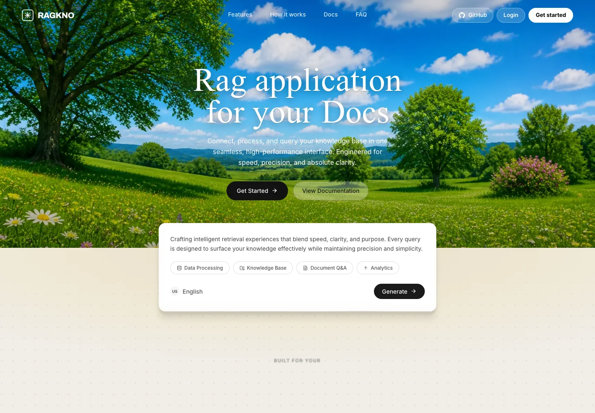
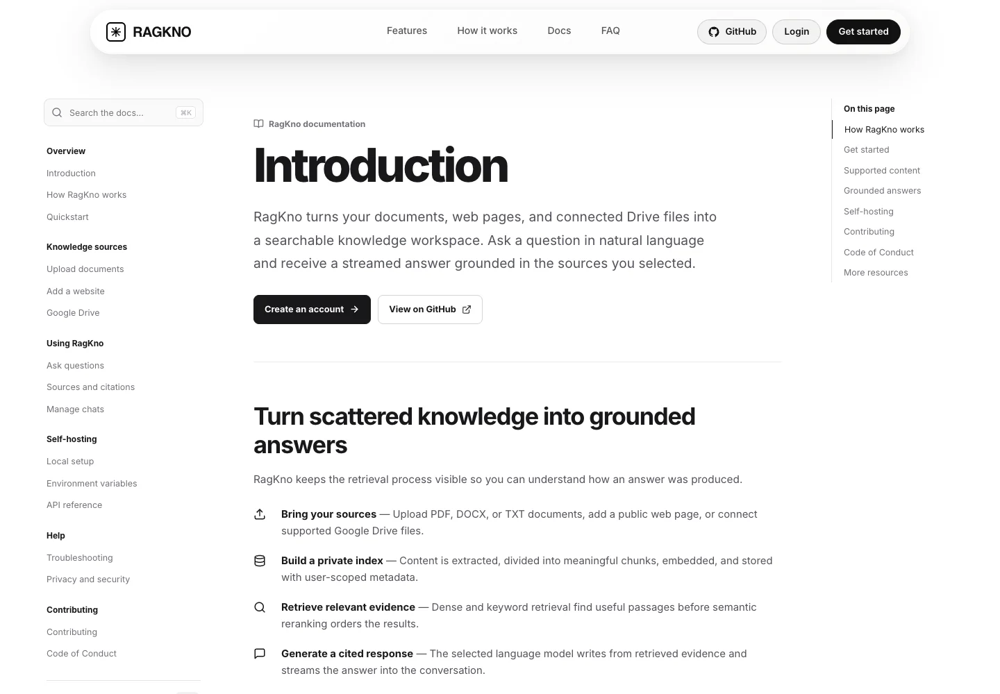
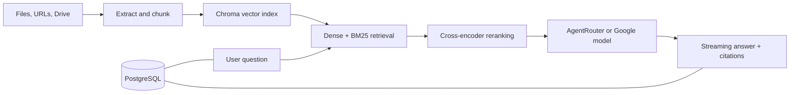

<div align="center">

# RagKno

**Ask naturally. Verify every answer.**

An open-source retrieval-augmented generation workspace for turning documents, websites, and Google Drive files into cited, streaming answers.

[](https://github.com/GitHpriyanshu23/Ragkno)
[](https://github.com/GitHpriyanshu23/Ragkno/actions/workflows/ci.yml)
[](LICENSE.md)
[](https://www.python.org/)
[](https://react.dev/)

[Documentation](#documentation) · [Quickstart](#quickstart) · [Deployment](docs/DEPLOYMENT.md) · [Contributing](CONTRIBUTING.md)

</div>



## What RagKno does

RagKno gives each user a private knowledge workspace. Add supported files, a public web page, or selected Google Drive documents; RagKno extracts and chunks the content, indexes it with user-scoped metadata, retrieves and reranks relevant evidence, and streams an answer with citations back to the conversation.

- **Multiple knowledge sources** — PDF, DOCX, TXT, public URLs, and Google Drive
- **Grounded conversations** — dense and keyword retrieval, semantic reranking, parent-context expansion, and inline citations
- **Streaming interface** — token streaming over server-sent events with visible retrieval progress
- **Private workspaces** — authenticated users, scoped threads, messages, sources, vectors, and Drive credentials
- **Conversation management** — persistent chat history, rename/delete controls, Markdown, and responsive UI
- **Evaluation** — a RAGAS-based evaluation command and sample dataset
- **Self-hosting** — Docker backend, Cloudflare Pages proxy, health endpoints, and environment templates

## Product preview



## How it works



The React client talks to FastAPI through `/api`. In production, a Cloudflare Pages Function forwards that path to the backend, keeping sessions first-party while streaming the response. PostgreSQL stores accounts, threads, messages, source metadata, and encrypted Drive credentials. Chroma stores the vector index on a persistent volume.

## Stack

- **Frontend:** React 18, Vite, React Router, Motion, GSAP
- **API:** FastAPI, Uvicorn, Pydantic
- **Retrieval:** ChromaDB, sentence-transformers, BM25, CrossEncoder reranking
- **Generation:** AgentRouter by default; Google Generative AI is supported as an alternative
- **Persistence:** PostgreSQL in production, SQLite for local development, and Chroma on disk
- **Hosting target:** Cloudflare Pages + Pages Functions for the frontend; Docker on Hugging Face Spaces for the API

## Quickstart

### Requirements

- Python 3.13
- [uv](https://docs.astral.sh/uv/)
- Node.js 22 and npm
- An AgentRouter key or Google AI key

### 1. Clone and configure

```bash
git clone https://github.com/GitHpriyanshu23/Ragkno.git
cd Ragkno
cp .env.example .env
```

For a minimal local run, set one model provider in `.env`:

```env
LLM_PROVIDER=agentrouter
AGENTROUTER_API_KEY=your_key
AGENTROUTER_MODEL=deepseek-v4-flash
FRONTEND_URL=http://localhost:5173
ENV=development
PORT=8000
```

When `DATABASE_URL` is omitted locally, RagKno uses an ignored SQLite database. Google OAuth variables are only required for Google sign-in and Drive sync.

### 2. Install dependencies

```bash
uv sync --dev
npm --prefix frontend ci
```

### 3. Run the application

In terminal one:

```bash
uv run uvicorn backend.main:app --host 127.0.0.1 --port 8000 --reload
```

In terminal two:

```bash
npm --prefix frontend run dev
```

Open [http://localhost:5173](http://localhost:5173). API documentation is available at [http://localhost:8000/docs](http://localhost:8000/docs).

## Environment variables

Start from [`.env.example`](.env.example). The production-critical settings are:

| Variable | Purpose |
| --- | --- |
| `DATABASE_URL` | PostgreSQL connection used for users, sessions, chats, metadata, and OAuth tokens |
| `AGENTROUTER_API_KEY` | Primary model-provider credential |
| `LLM_PROVIDER` | `agentrouter` or `google` |
| `RAGKNO_SESSION_SECRET` | Random secret of at least 32 characters |
| `FRONTEND_URL` | Canonical HTTPS frontend origin |
| `GOOGLE_CLIENT_ID` / `GOOGLE_CLIENT_SECRET` | Google login and Drive OAuth credentials |
| `GOOGLE_APP_REDIRECT_URI` | Google sign-in callback, normally `https://app.example.com/api/login/google/callback` |
| `GOOGLE_REDIRECT_URI` | Drive callback, normally `https://app.example.com/api/auth/callback` |
| `RAGKNO_DATA_DIR` | Durable runtime directory; `/data` in the Docker deployment |
| `CHROMA_PERSIST_DIR` | Optional explicit Chroma location |

Never commit `.env`, provider keys, OAuth credentials, database files, uploaded documents, or vector-store data. The repository ignore rules cover these artifacts; run the readiness checks below before every public release.

## Deployment

The supported deployment path is:

1. **Cloudflare Pages** builds `frontend/` and serves the application.
2. **Cloudflare Pages Functions** proxies `/api/*` to the backend so cookies and OAuth callbacks remain first-party.
3. **Hugging Face Docker Space** runs FastAPI on port `7860` with one worker.
4. **Persistent storage mounted at `/data`** preserves embeddings and model cache across Space restarts.
5. **Managed PostgreSQL** preserves user and conversation data.

Follow the complete, ordered setup in **[Deployment guide](docs/DEPLOYMENT.md)**. It includes Cloudflare build settings, Hugging Face secrets, OAuth callback URLs, persistence, smoke tests, rollback, and the current hosting limitations.

## API

FastAPI publishes an interactive OpenAPI reference at `/docs`. Common routes include:

- `GET /health/live` and `GET /health/ready`
- `POST /auth/register`, `POST /auth/login`, and `POST /auth/logout`
- `GET|POST /threads` and `GET /threads/{id}/messages`
- `POST /ingest/files`, `POST /ingest/url`, and `POST /drive/sync`
- `POST /query` and `POST /query/stream`
- `GET /ingest/sources` and `POST /ingest/unindex`

Mutation routes validate the session and CSRF token. Retrieval and source operations are scoped to the authenticated user.

## Quality checks

```bash
uv lock --check
uv run pytest -q
uv sync --group evaluation
uv run python evaluation/ragas_eval.py --help
npm --prefix frontend test
npm --prefix frontend run build
git diff --check
```

Run the sample RAGAS evaluation after indexing a representative dataset:

```bash
uv sync --group evaluation
uv run python evaluation/ragas_eval.py \
  --dataset evaluation/testset.sample.json \
  --user-id YOUR_USER_ID \
  --top-k 3
```

## Repository layout

```text
backend/                 FastAPI routes, auth, ingestion, and streaming
frontend/                React application and Cloudflare Pages Function
src/                     Retrieval, storage, ingestion, and Drive integration
evaluation/              RAGAS evaluation command and sample dataset
deploy/huggingface/      Hugging Face Space metadata template
docs/                    Deployment guide and repository screenshots
.github/workflows/       CI checks
```

## Documentation

The app includes a responsive documentation experience at `/docs`. Repository documentation includes:

- [Production deployment](docs/DEPLOYMENT.md)
- [Contributing](CONTRIBUTING.md)
- [Security policy](SECURITY.md)
- [Code of Conduct](CODE_OF_CONDUCT.md)

## Contributing

Issues and pull requests are welcome. Read [CONTRIBUTING.md](CONTRIBUTING.md) for setup, branch, commit, test, and pull-request guidance. Please follow the [Code of Conduct](CODE_OF_CONDUCT.md). Report vulnerabilities privately using the process in [SECURITY.md](SECURITY.md).

## License

RagKno is available under the [Apache License 2.0](LICENSE.md).
