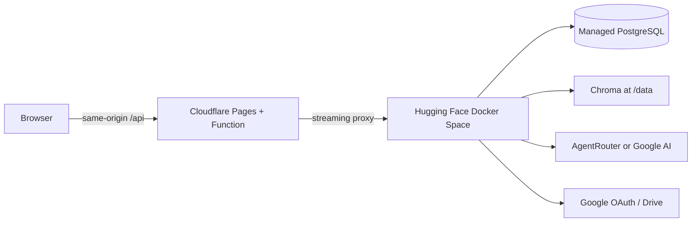

# Deploy RagKno with Cloudflare Pages and Hugging Face Spaces

This guide deploys the React frontend to Cloudflare Pages, the FastAPI backend to a Hugging Face Docker Space, and keeps application state in managed PostgreSQL plus persistent Space storage.

## Read this before creating services

Hugging Face currently lists **CPU Basic** as 2 vCPU, 16 GB RAM, and 50 GB of non-persistent disk. It sleeps after inactivity. Hugging Face also states that creating a Docker or Gradio compute Space requires a paid account plan; the no-cost personal option is limited to eligible ZeroGPU Gradio Spaces. Confirm the current terms in the [Spaces overview](https://huggingface.co/docs/hub/en/spaces-overview) and [hardware documentation](https://huggingface.co/docs/hub/en/spaces-gpus) before depending on this design.

The default Space disk is ephemeral. RagKno's Chroma index must survive restarts, so attach a [Storage Bucket or persistent storage](https://huggingface.co/docs/hub/main/spaces-storage) at `/data`. Deploying without it can leave PostgreSQL source records that point to vectors that no longer exist.

This platform combination is suitable for an open-source demo and moderate personal use. Cold starts, sleeping, CPU-only inference, and Space-plan requirements make it less predictable for an always-on production service. For a commercial deployment, use a backend host with an always-on 8–16 GB instance or move vectors to a managed service such as Qdrant, Pinecone, or PostgreSQL with pgvector.

## Architecture



The same-origin `/api` proxy is intentional. It avoids relying on a third-party session cookie between a Pages domain and `hf.space`, preserves SSE streaming, and gives Google OAuth a frontend-domain callback.

## 1. Prepare external services

Create:

- A managed PostgreSQL database. Supabase is supported by the existing schema bootstrap.
- An AgentRouter key, or a Google AI key and `LLM_PROVIDER=google`.
- A Google OAuth web client if Google sign-in or Drive sync will be enabled.
- A Hugging Face account permitted to create a Docker Space.
- A Cloudflare account connected to the GitHub repository.

Generate the session secret locally:

```bash
python -c "import secrets; print(secrets.token_urlsafe(48))"
```

## 2. Create the Cloudflare Pages project

Connect the GitHub repository using Cloudflare's [React deployment flow](https://developers.cloudflare.com/pages/framework-guides/deploy-a-react-site/) and use:

| Setting | Value |
| --- | --- |
| Production branch | `main` |
| Root directory | `frontend` |
| Build command | `npm run build` |
| Build output directory | `dist` |
| Node version | `22` |

Set this build variable for Preview and Production:

```env
VITE_API_URL=/api
```

The first deployment can complete before the backend exists. Record the generated `https://<project>.pages.dev` URL or attach the final custom domain now.

The repository's `frontend/functions/api/[[path]].js` becomes the `/api/*` proxy. Cloudflare documents Pages Functions and file routing in its [Functions guide](https://developers.cloudflare.com/pages/functions/) and [routing guide](https://developers.cloudflare.com/pages/functions/routing/).

## 3. Configure Google OAuth

In the Google Cloud Console, configure the final frontend origin. If the production frontend is `https://ragkno.example.com`, add:

**Authorized JavaScript origin**

```text
https://ragkno.example.com
```

**Authorized redirect URIs**

```text
https://ragkno.example.com/api/login/google/callback
https://ragkno.example.com/api/auth/callback
```

Use exact URLs. Preview deployments have different hosts; add a specific preview callback only when you intend to test OAuth there.

## 4. Create the Hugging Face Docker Space

1. Create a new Space and choose **Docker** as the SDK.
2. Use the contents of `deploy/huggingface/README.md` as the Space README front matter.
3. Push the project files to the Space repository. The root `Dockerfile` exposes port `7860` and starts one Uvicorn worker.
4. Attach persistent storage or a Storage Bucket at `/data`.
5. Record the direct runtime origin: `https://<owner>-<space>.hf.space`.

Hugging Face's [Docker Spaces guide](https://huggingface.co/docs/hub/main/spaces-sdks-docker) explains `app_port`, secrets, and Docker runtime behavior.

### Space secrets

Add these as **Secrets**, never ordinary variables:

```env
DATABASE_URL=postgresql://...
AGENTROUTER_API_KEY=...
RAGKNO_SESSION_SECRET=...
GOOGLE_CLIENT_ID=...
GOOGLE_CLIENT_SECRET=...
```

If Google AI is the provider, store `GOOGLE_API_KEY` as a secret instead of `AGENTROUTER_API_KEY`.

### Space variables

Replace the example frontend URL:

```env
ENV=production
LLM_PROVIDER=agentrouter
AGENTROUTER_BASE_URL=https://agentrouter.org/v1
AGENTROUTER_MODEL=deepseek-v4-flash
AGENTROUTER_FALLBACK_MODELS=gpt-5.5
LLM_CONNECT_TIMEOUT_SECONDS=10
LLM_REQUEST_TIMEOUT_SECONDS=45
FRONTEND_URL=https://ragkno.example.com
CORS_ORIGINS=https://ragkno.example.com
GOOGLE_APP_REDIRECT_URI=https://ragkno.example.com/api/login/google/callback
GOOGLE_REDIRECT_URI=https://ragkno.example.com/api/auth/callback
RAGKNO_DATA_DIR=/data
RAG_EMBEDDING_DEVICE=cpu
RAG_RERANKER_DEVICE=cpu
RAG_RERANKER_BATCH_SIZE=8
PORT=7860
WEB_CONCURRENCY=1
```

Keep one worker. Each process can load its own embedding and reranker models, multiplying memory usage and fragmenting the in-process caches and OAuth verifier state.

## 5. Connect Cloudflare to the Space

In **Cloudflare Pages → Settings → Variables and Secrets**, add this runtime variable to Preview and Production:

```env
BACKEND_ORIGIN=https://<owner>-<space>.hf.space
```

Do not add a trailing `/api`; RagKno's backend routes live at the root. Redeploy the Pages project after changing the binding. Cloudflare's [bindings documentation](https://developers.cloudflare.com/pages/functions/bindings/) covers runtime variables used by Pages Functions.

## 6. Validate the deployment

Run these checks against the public frontend:

```bash
curl -fsS https://ragkno.example.com/api/health/live
curl -fsS https://ragkno.example.com/api/health/ready
```

Then test in a private browser window:

1. Register and sign in.
2. Sign out and sign back in to verify the session cookie.
3. Upload a small supported file.
4. Ask a question and confirm tokens stream instead of arriving as one response.
5. Open a citation and verify it belongs to the active user.
6. Restart the Space and confirm the uploaded source still answers questions.
7. Connect Google Drive, sync one document, and disconnect it.

`/health/live` only confirms that the process is running. `/health/ready` checks the database, vector store, and model configuration and can take longer on the first request while models load.

## 7. Operations

- Watch Space build/runtime logs and Cloudflare Function logs during the first release.
- Back up PostgreSQL and the `/data` storage independently.
- Rotate provider and OAuth secrets immediately if they appear in logs or commits.
- Keep `main` protected and require the repository CI workflow before merging.
- Deploy with a specific Git commit so a rollback is a redeploy of the previous known-good revision.
- Expect a cold start after a free CPU Space sleeps; use an always-on backend plan if response time is a product requirement.

## Local test of the Cloudflare proxy

After building the frontend:

```bash
cp frontend/.dev.vars.example frontend/.dev.vars
npm --prefix frontend run build
cd frontend
npx wrangler pages dev dist
```

`frontend/.dev.vars` is ignored by Git. The example forwards `/api` to a backend running at `http://127.0.0.1:8000`.
